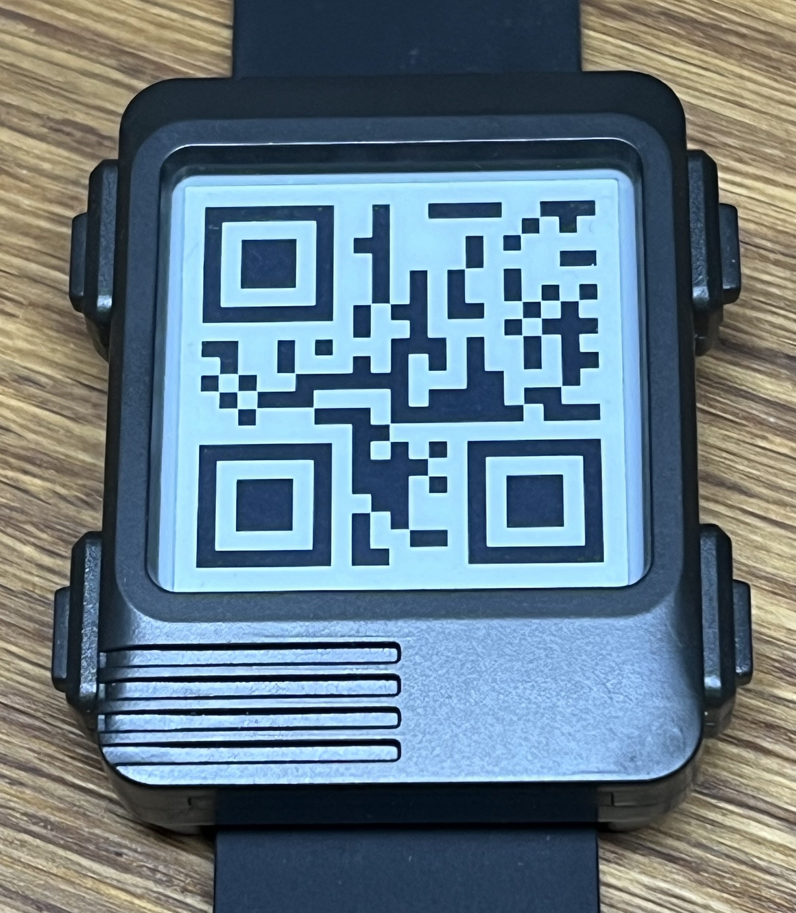

# Watchy code by RevK

This is planned to be code for the SQFMI Watchy product - it is a work in progress.

- [x] Base build and flash
- [x] OTA
- [ ] Battery level reading
- [ ] Buttons
- [x] OLED display
- [x] OLED soft/partial updates (e.g. for 7 seg digits)
- [x] OLED sleep mode control
- [ ] Accelerometer
- [ ] RTC
- [ ] Low power mode (inc work on RevK library to support)
- [ ] Low power with buttons
- [ ] Watch face design
- [ ] Basic menus
